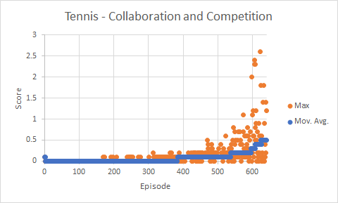

## Project 3: Collaboration and Competition

**Project Submission by Bill Webb**

**April 2020**

**Project 3** - Using the Unity ML-Agents environment for the third project of the [Deep Reinforcement Learning Nanodegree](https://www.udacity.com/course/deep-reinforcement-learning-nanodegree--nd893).

### Introduction

For this project, we will work with the [Tennis](https://github.com/Unity-Technologies/ml-agents/blob/master/docs/Learning-Environment-Examples.md#tennis) environment.

![Trained Agent][image1]

In this environment, two agents control rackets to bounce a ball over a net. If an agent hits the ball over the net, it receives a reward of +0.1.  If an agent lets a ball hit the ground or hits the ball out of bounds, it receives a reward of -0.01.  Thus, the goal of each agent is to keep the ball in play.

The observation space consists of 8 variables corresponding to the position and velocity of the ball and racket. Each agent receives its own, local observation.  Two continuous actions are available, corresponding to movement toward (or away from) the net, and jumping.

The task is episodic, and in order to solve the environment, your agents must get an average score of +0.5 (over 100 consecutive episodes, after taking the maximum over both agents). Specifically,

- After each episode, we add up the rewards that each agent received (without discounting), to get a score for each agent. This yields 2 (potentially different) scores. We then take the maximum of these 2 scores.
- This yields a single **score** for each episode.

The environment is considered solved, when the average (over 100 episodes) of those **scores** is at least +0.5.

### Learning Algorithm

Sources
- [Multi-Agent Actor-Critic for Mixed Cooperative-Competitive Environments](https://papers.nips.cc/paper/7217-multi-agent-actor-critic-for-mixed-cooperative-competitive-environments.pdf)
- [Continuous Control with Deep Reinforcement Learning](https://arxiv.org/pdf/1509.02971.pdf)
- Udacity DDPG and MADDPG agent implementations and examples

The Multi-Agent Deep Deterministic Policy Gradient (MADDPG) algorithm is utilized to solve this project.  DDPG is a model-free, off-policy actor-critic algorithm that utilizes deep function approximators.  DDPG is augmented to support multiple agents.  Each agent has its own Actor while a single Critic is shared between the Actors.  This enables an environment where execution is decentralized (Agents can only use local information at execution time) yet learning is centralized.

The advantages in applying this algorithm to the Collaboration and Competition problem include:

- Ideal for continuous and high dimensional action and state space
- Actor-Critic
-- Actor - policy-based (better for continuous) - one instance per Actor - determines agents action independently
-- Critic - value-based - single instance for all Actors - provides feedback about the action
-- Increases stability and reduces bias of the algorithm
- Model-Free - to support high dimensionality, estimates the optimal policy and value functions rather than determining the dynamics of the environment
- Off-Policy - slowly updates active policy based on learned policy to maintain stability of the agent

Several improvements were implemented to ensure the best performance of the algorithm, as outlined in the following sections.

#### Deep Learning

There are two neural network models, one each for the Actor and Critic.  In addition, there is a local and target instance of each model, in order to support off-policy learning.

The architecture follows that from the DDPG paper, Section 7 (Lillicrap, et al., 2016) and is modified to support MADDPG.

##### Actor Model

The Actor is a policy-based model which is used by the agent to determine actions.  The following model is defined for the project:

- Input - 24 states, from the environment
- Layer 1 - Linear - 512 nodes
- Batch Normalization Layer
- Layer 2 - Linear - 256 nodes
- Output - Linear - 2 action size
- Tanh activation - to bound the actions

The NN returns the torque to apply to the two joints of the Reacher environment.

##### Critic Model

The Actor is a value-based model which is used by the agent to improve.  The following model is defined for the project:

- Input - 24 states, from the environment
- Layer 1 - Linear - 512 nodes
- Batch Normalization Layer
- Layer 2 - Linear - 256 nodes - Actions included
- Output - Linear - 1 action size
- ReLU activation - due to sparsity

The NN returns whether the action taken was good or bad as a feedback loop.

##### Hyperparameters

Given the low-dimensional 24 state size,  hyperparameters presented in the DDPG paper were utilized as a starting place and then adjusted based on learning iterations.

- Buffer size - int(1e6)
- Batch size - 64
- Discount factor (Gamma) - 0.99
- Soft update for target (off-policy) - 2e-1
- Actor learning rate - 1e-4
- Critic learning rate - 3e-4
- Learning timestep interval - 20
- Learning number - 10
- Ornstein-Uhlenbeck noise Sigma - 0.2
- Ornstein-Uhlenbeck noise Theta - 0.15
- Noise step Epsilon - 1.0
- Noise process decay rate - 1e-6

##### Soft Updates

Two copies - regular & target
Target updates with soft update strategy - slowing blending regular with target; every timestep only mix in 0.01% of regular to target.  Faster convergence.
DDPG uses an off-policy method, where both the Actor and Critic each have a regular/local and target network.  In order to increase stability during the learning process, the target network is used to select actions when learning with the replay buffer samples.  Then, the updates based on loss are done to the regular network rather than the regular network.  The weights of the regular network are slowly blended into the target network with a factor of 0.001 per learning step.  This allows the target network to slowly, but regularly, converge to the optimal weights but retain model stability.

This contrasts with other approaches, where the regular network is copied to the target network every X timesteps.  This approach typically leads to model instability and/or increased learning time.

##### Replay Buffer

Experience replay is utilized to prevent correlation between sequence of steps.  In additional, it allows learning from rare step tuples multiple times.  As each step is taken, the step tuple is added to the replay buffer.  Then, during the learning step, a batch of random tuples are chosen to build the target model then backpropogate the error in the current model.

##### Exploration and Noise

The agent has not prior knowledge of the transition model.  In order to find the optimal model, the agent must continue to level of exploration to discovery better, optimal actions/transitions.  During the selection of an action by the agent, the Ornstein-Uhlenbeck noise process is applied to the deterministic continuous action result.  This will result in actions taken by the agent that vary enough from the model explore and possibly discovery better actions.

### Results

Full results can be found in the `p3.log` file.  The problem was solved in 258 episodes, with an average score of 0.5 over the last 100 episodes.



```
Episode 349 (5 sec)  --         Min: 0.4        Max: 0.4        Mean: 0.4       Mov. Avg: 0.4
Episode 350 (0 sec)  --         Min: -0.0       Max: 0.0        Mean: -0.0      Mov. Avg: 0.4
Episode 351 (21 sec)  --        Min: 1.8        Max: 1.8        Mean: 1.8       Mov. Avg: 0.5
Episode 352 (0 sec)  --         Min: -0.0       Max: 0.0        Mean: -0.0      Mov. Avg: 0.5
Episode 353 (22 sec)  --        Min: 1.9        Max: 2.0        Mean: 1.9       Mov. Avg: 0.5
Episode 354 (3 sec)  --         Min: 0.2        Max: 0.2        Mean: 0.2       Mov. Avg: 0.5
Episode 355 (3 sec)  --         Min: 0.2        Max: 0.2        Mean: 0.2       Mov. Avg: 0.5
Episode 356 (18 sec)  --        Min: 1.5        Max: 1.5        Mean: 1.5       Mov. Avg: 0.5
Episode 357 (4 sec)  --         Min: 0.3        Max: 0.3        Mean: 0.3       Mov. Avg: 0.5
Episode 358 (14 sec)  --        Min: 1.2        Max: 1.2        Mean: 1.2       Mov. Avg: 0.5
Environment SOLVED in 258 episodes!     Moving Average =0.5 over last 100 episodes
```

### Ideas for Future Work

- Distributed training with more matches/Actors.  The matches/Actors all share the same Critic and would result in increased learning efficiency.

- A low-dimensional network was utilized, as the environment included 24 states, which includes the position and velocity of the joints, etc.  When taking the model to a real-world/physical agent, this state information may not be available.  Therefore, it would be desirable to apply DDPG based off of camera pixels, resulting in a high-dimensional network.
